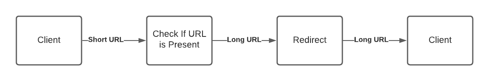

# Micro-URL
A web service for shortening URLs. Takes a long URL the returns a shorten version to the client, when the short URL is clicked the client application is directed to the original URL.

## Functional requirements.
1. User can submit and receive a shorter version of a URL.
2. Created URL can be customized.
3. URL can be created with expiration time.
4. Advanced analytics on URL interactions ie. clicks.
5. Generate QR code for the shorter URL.

## Non-functional requirements.
1. Security, the web service shoud be secured.
2. Scalable, the web service should at scale.
3. Latency, low latency when serving client request.
4. Peformance, the service should offer high peformance to users.

## High Level Design

1. URL creation Dataflow Design
   
2. Get Original URL Dataflow Design
   

## Tools and Requirements
1. [MongoDB]("https://www.mongodb.com/) - MongoDB is a source-available cross-platform document-oriented database program. Classified as a NoSQL database program, MongoDB uses JSON-like documents with optional schemas. MongoDB is developed by MongoDB Inc.
2. [Redis Cache]("https://redis.io/") - Redis is an in-memory data structure store, used as a distributed, in-memory key–value database, cache and message broker, with optional durability.
3. [Go]("https://go.dev/") - Go is a statically typed, compiled programming language designed at Google by Robert Griesemer, Rob Pike, and Ken Thompson.
4. [Docker]("https://www.docker.com/") - Docker is a set of platform as a service products that use OS-level virtualization to deliver software in packages called containers. Containers are isolated from one another and bundle their own software, libraries and configuration files; they can communicate with each other through well-defined channels.

